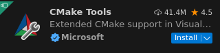
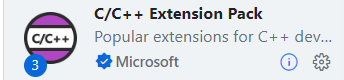
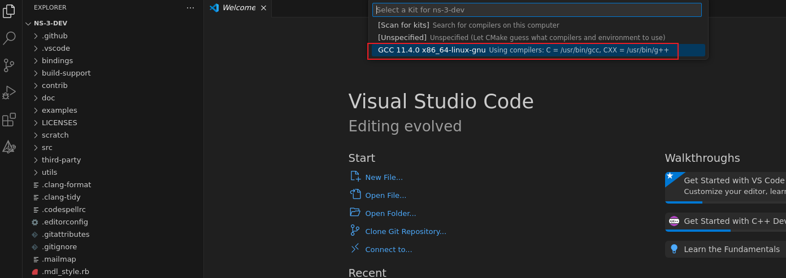
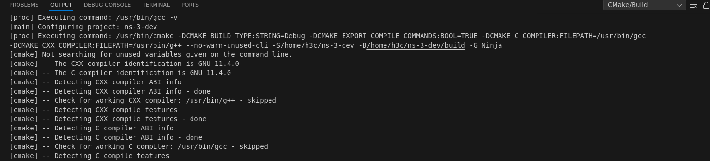
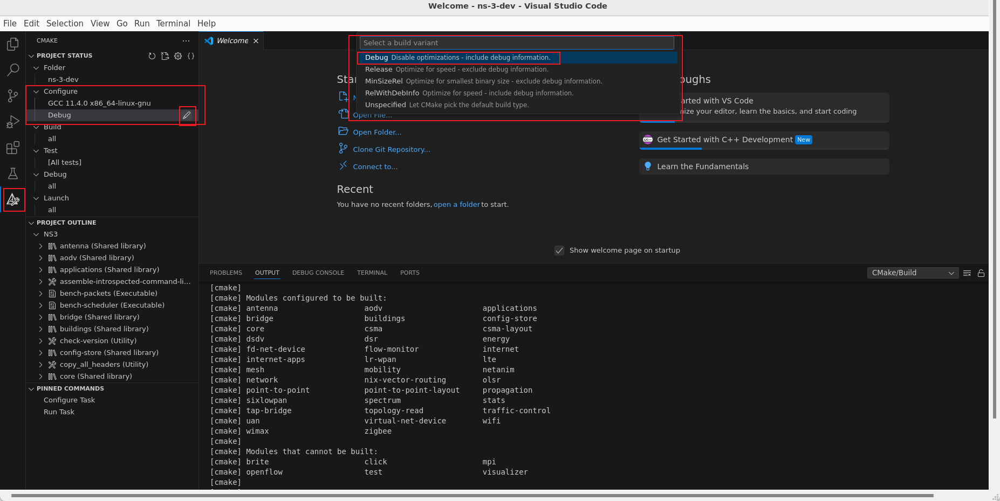
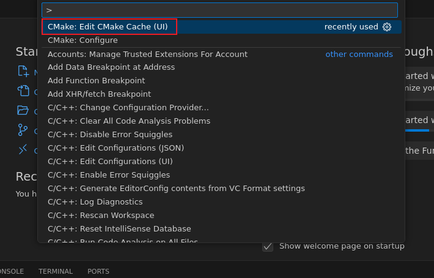

# How to start with Visual Studio Code

## Linux Solution

### Environment

Ubuntu 22.04

Visual Studio Code 1.96.2

### Install the requirements

```shell
sudo apt -y install cmake
sudo apt -y install ninja-build
```

### Install Visual Studio Code

Follow the Ref. 2.

### Clone ns-3 project

```shell
git clone https://gitlab.com/nsnam/ns-3-dev.git
```

### Open Visual Studio Code and do some configurations

Install some plugins:






Open ns-3 project and configure it.

Press `Ctrl+shift+P` key and select:


Choose existed kit in your computer:



Then you can see cmake begin to work.



In order to see some output, set the CMAKE_BUILD_TYPE to Debug:



Press `Ctrl+shift+P` key and select:



In order to build the official examples, set the NS3_EXAMPLES to ON:


### Build the project


### Test ns-3

Open `examples/tutorial/first.cc` , run it.


### Other configurations

The performance of the original Visual Studio Code C/C++ IntelliSense engine is not very good. We can use the clangd plugin as an alternative.


You also need to ensure that clangd is installed on your system. If not, try:

```shell
sudo apt -y install clangd
```

Then, disable the original Visual Studio Code C/C++ IntelliSense engine:


The ns-3 official offers coding styles, you can install some plugins:


### How to pass environment variables and program arguments to the program in Visual Studio Code while using CMake

Add the following configuration to `.vscode/settings.json` :

```json
    "cmake.debugConfig": {
        "args": [
            "--traceFile=/home/h3c/ns-3-dev/scratch/ns-3-vanet-scratch/area1ns2mobility.tcl",
            "--configFile=/home/h3c/ns-3-dev/scratch/ns-3-vanet-scratch/area1ns2config.tcl",
            "--rsuNum=4"
        ],
    },
    "cmake.environment": {
        "NS_LOG": "experiment=debug:VehicleApp=debug:RsuApp=debug"
    }
```


### References

1 [4. Linux](https://www.nsnam.org/docs/release/3.42/installation/html/linux.html)
2. [Ubuntu 22.04安装Visual Studio Code(VS Code)](https://blog.csdn.net/u010044182/article/details/128977610)
3. [How to set CMake build configuration in VSCode?](https://stackoverflow.com/questions/73328916/how-to-set-cmake-build-configuration-in-vscode)
4. [关于在Vscode安装clangd的教程（分别在linux和windows）[很详细，很细节，很全！]【Windows端：缺少 language enginee的解决方法】](https://blog.csdn.net/qq_42764906/article/details/135541847)
