# 如何使用 Visual Studio Code 进行开发

## Linux 解决方案

### 环境

Ubuntu 22.04

Visual Studio Code 1.96.2

### 安装依赖

```shell
sudo apt -y install cmake
sudo apt -y install ninja-build
```

### 安装 Visual Studio Code

跟随参考文献2照着做即可。

### 下载 ns-3 仓库

```shell
git clone https://gitlab.com/nsnam/ns-3-dev.git
```

### 打开 Visual Studio Code 并进行配置

安装一些插件：

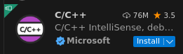

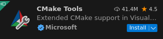

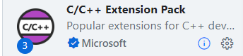

用 Visual Studio Code 打开 ns-3 的项目并配置它。

按 `Ctrl+shift+P` 键并选择：

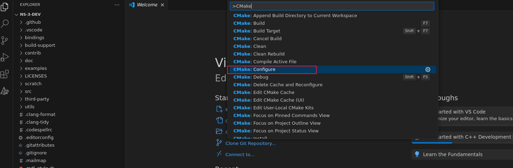

选择你电脑上存在的工具链：

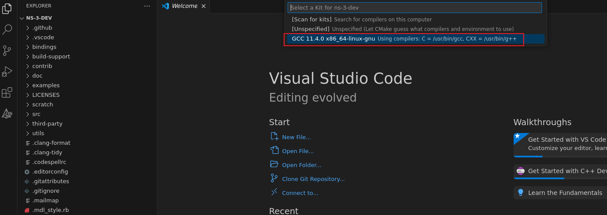

然后你可以看到 CMake 开始工作。

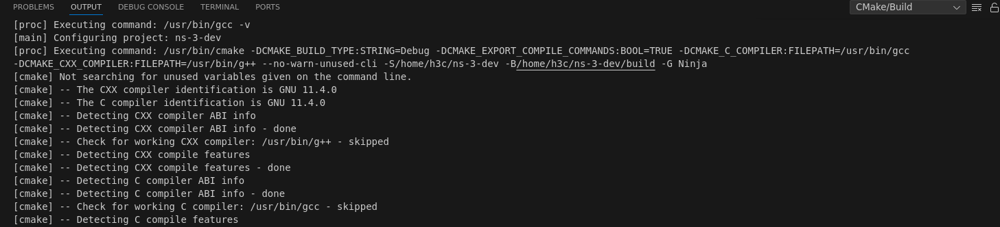

为了看到一些输出，设置 CMAKE_BUILD_TYPE 的值为 Debug ：

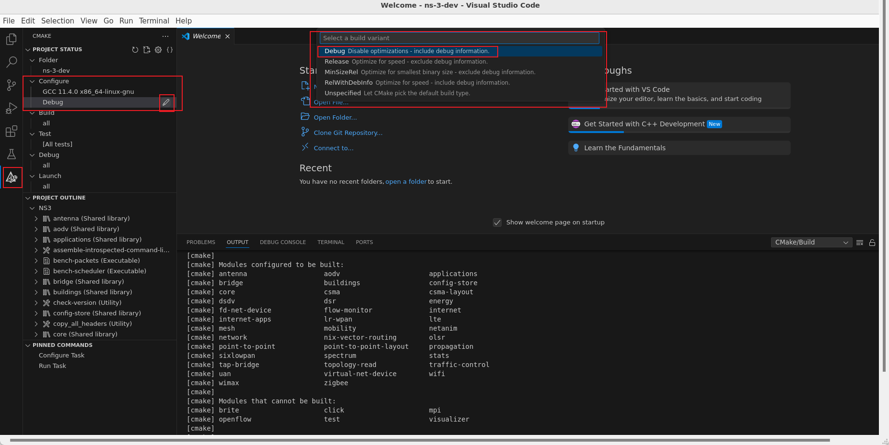

按 `Ctrl+shift+P` 键并选择：

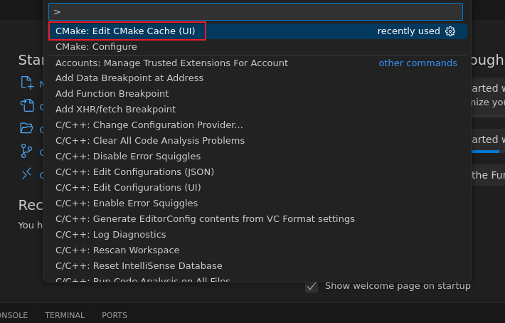

为了构建官方示例，设置 NS3_EXAMPLES 的值为 ON ：

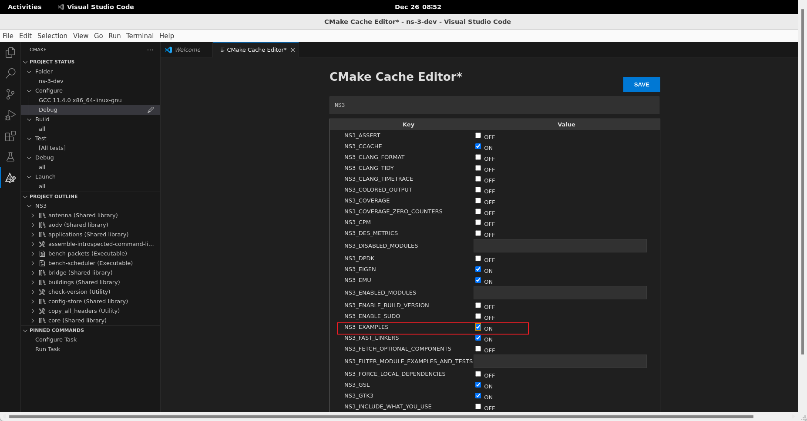

### 构建项目

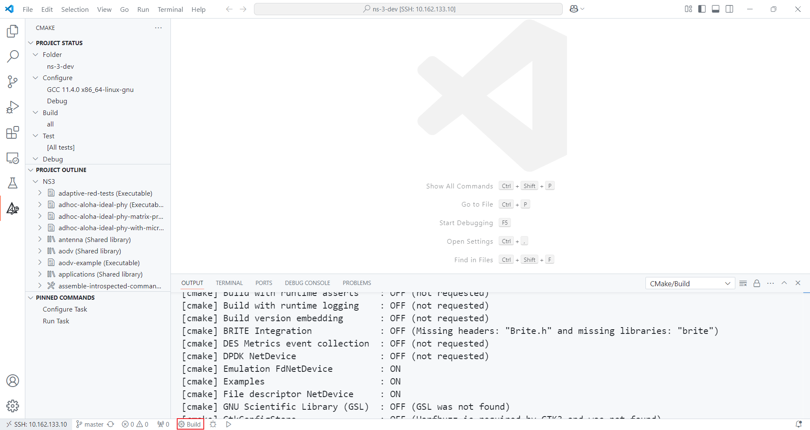

### 测试 ns-3

打开 `examples/tutorial/first.cc` 并运行：

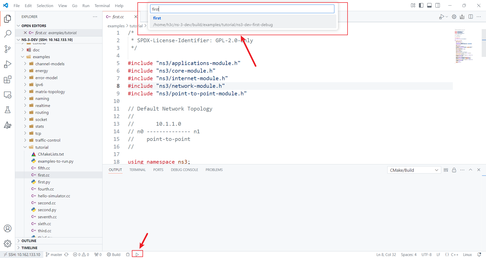

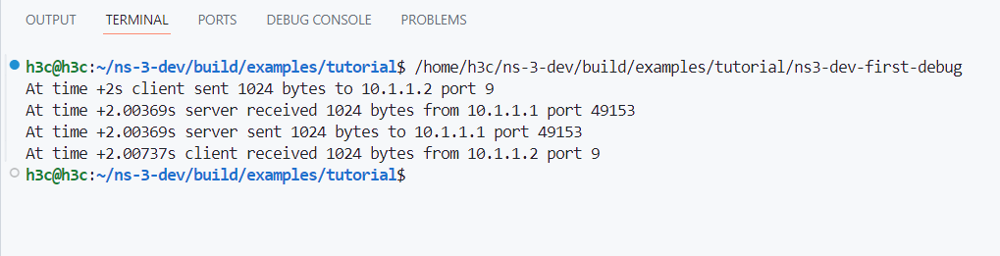

### 其它配置

Visual Studio Code 原来的 C/C++ IntelliSense engine 效果并不好。我们可以使用 clangd 插件作为代替。


你需要确保你的系统上安装了 clangd 。如果没有请尝试：

```shell
sudo apt -y install clangd
```

然后禁用原来的 Visual Studio Code C/C++ IntelliSense engine ：

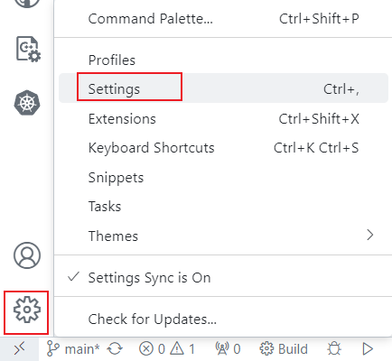

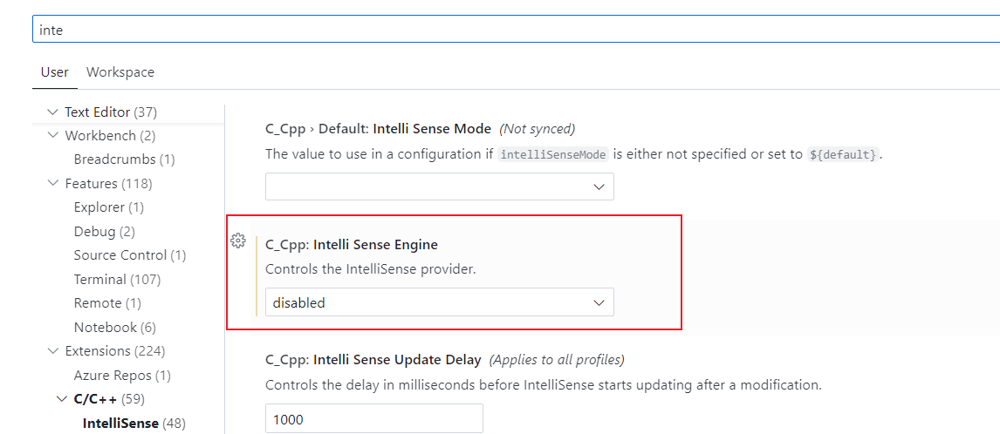

ns-3 官方提供了编码风格，你可以安装以下插件来启用并在设置里开启保存时格式化：

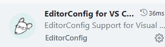

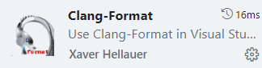

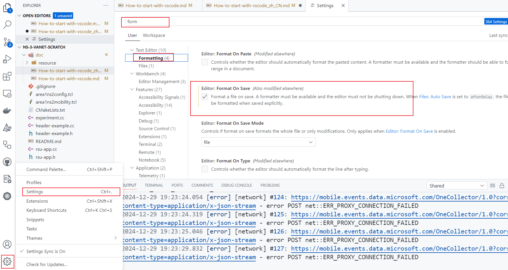

### 在使用 CMake 时如何在 Visual Studio Code 里传递环境变量和程序参数给程序

往 `.vscode/settings.json` 里添加以下配置：

```json
    "cmake.debugConfig": {
        "args": [
            "--traceFile=/home/h3c/ns-3-dev/scratch/ns-3-vanet-scratch/area1ns2mobility.tcl",
            "--configFile=/home/h3c/ns-3-dev/scratch/ns-3-vanet-scratch/area1ns2config.tcl",
            "--rsuNum=4"
        ],
    },
    "cmake.environment": {
        "NS_LOG": "experiment=debug:VehicleApp=debug:RsuApp=debug"
    }
```

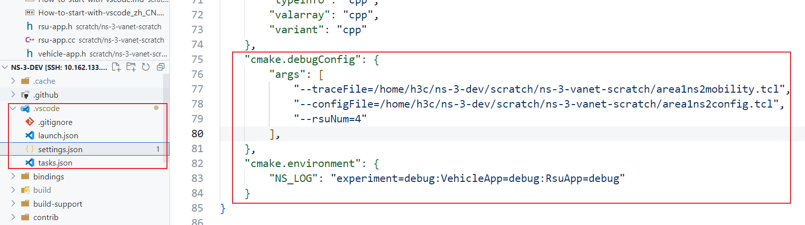

### 如何运行或调试程序

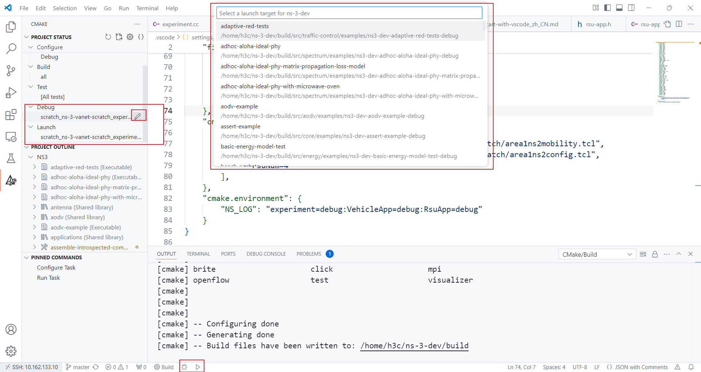

### 参考文献

1. [4. Linux](https://www.nsnam.org/docs/release/3.42/installation/html/linux.html)
2. [Ubuntu 22.04安装Visual Studio Code(VS Code)](https://blog.csdn.net/u010044182/article/details/128977610)
3. [How to set CMake build configuration in VSCode?](https://stackoverflow.com/questions/73328916/how-to-set-cmake-build-configuration-in-vscode)
4. [关于在Vscode安装clangd的教程（分别在linux和windows）[很详细，很细节，很全！]【Windows端：缺少 language enginee的解决方法】](https://blog.csdn.net/qq_42764906/article/details/135541847)
5. [4.3. Working with CMake](https://www.nsnam.org/docs/manual/html/working-with-cmake.html)
6. [Configure CMake Tools settings](https://github.com/microsoft/vscode-cmake-tools/blob/main/docs/cmake-settings.md)
7. [[vscode]使用cmake时将命令行参数传递给调试目标](https://blog.csdn.net/Strengthennn/article/details/136661436)
