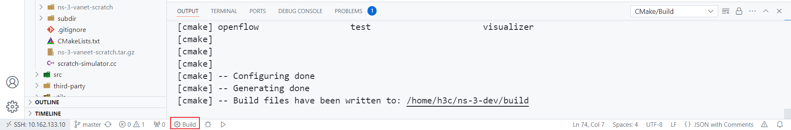
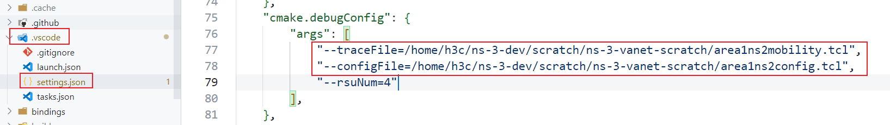

# 如何使用这个仓库

## 在 ns-3 项目的 `scratch` 目录下使用 Git 下载本仓库

```shell
cd /path/to/ns-3/project/scratch
git clone https://github.com/paigeman/ns-3-vanet-scratch.git
```

## 重新构建 ns-3 项目

在 Visual Studio Code 中，你可以这么做：



## 如何配置 SUMO 相关的参数

对于一些参数，比如说仿真区域、车辆密度和车辆速度，它们是由 Eclipse SUMO 提供的。

SUMO 提供了一个名为 `traceExporter.py` 的脚本，用于生成 ns2 移动性文件和 ns2 配置文件。你可以按照参考文献[1-17]来为本仓库生成必要的输入文件。

比如，如果你像这样使用 `traceExporter.py` ：

```shell
python traceExporter.py --fcd-input sumoTrace.xml --ns2mobility-output ns2mobility.tcl --ns2config-output config.tcl
```

本仓库需要的是 `ns2mobility.tcl` 和 `config.tcl` 。

然后你可以在 `.vscode/settings.json` 文件里替换 `traceFile` 和 `configFile` 的值：



`traceFile` 和 `configFile` 这两个参数在代码 `experiment.cc` 中定义和解析的部分是：

```cpp
// experiment.cc
std::string traceFile;
std::string configFile;
CommandLine cmd(__FILE__);
cmd.AddValue("traceFile", "Ns2 movement trace file", traceFile);
cmd.AddValue("configFile", "Configuration file", configFile);
cmd.Parse(argc, argv);
```

程序在接受到这两个参数的值后，对于 `traceFile` ，ns-3 官方有提供解析文件的方法，对于 `configFile` ，则需要自己定义对应的方法。

这里先介绍是怎么解析 `configFile` 的，因为大部分参数都是通过解析这个文件设置的， `traceFile` 只是保存了车辆的移动轨迹。

```cpp
// experiment.cc

uint32_t nodeNum;
double duration;
double start;
std::unordered_map<std::string, std::string> configMap;
ParseConfigFile(configFile, configMap);
// 设置节点数量
nodeNum = std::stoi(configMap["opt(nn)"]);
nodeNum = 1;
// 开始时间
start = std::stod(configMap["opt(start)"]);
// 设置duration
duration = std::stod(configMap["opt(stop)"]);

// 解析配置文件
static void
ParseConfigFile(const std::string& fileName,
                std::unordered_map<std::string, std::string>& configMap)
{
    std::ifstream file(fileName);
    if (!file.is_open())
    {
        std::cerr << "Error opening file: " << fileName << std::endl;
        return;
    }
    std::string line;
    while (std::getline(file, line))
    {
        if (line.empty())
        {
            continue;
        }
        // 忽略注释
        size_t pos_sharp = line.find_first_of('#');
        if (pos_sharp != std::string::npos)
        {
            line = line.substr(0, pos_sharp);
        }
        // 去除行首和行尾的空白字符
        while (!line.empty() && isblank(line[0]))
        {
            line.erase(0, 1); // Removes blank spaces at the beginning of the line
        }
        while (!line.empty() && isblank(line[line.size() - 1]))
        {
            line.erase(line.size() - 1, 1); // Removes blank spaces from at end of line
        }
        std::istringstream iss(line);
        std::string keyword;
        std::string key;
        std::string value;
        iss >> keyword;
        // 如果不是set打头直接跳过
        if (keyword != "set")
        {
            continue;
        }
        iss >> key >> value;
        configMap[key] = value;
    }
    file.close();
}
```

上面的代码， `ParseConfigFile` 部分应该没有什么需要变动的，除非你的需求需要用到里面的一些不是以 `set` 打头的行或者碰到本仓库没有考虑到的情况。另外，注意到这里的 `nodeNum` 在从配置文件中取值后被设置为了1，这是因为本仓库为了简单只演示了一个车辆和一个 RSU 通信的情况。 `duration` 也可以被认为是仿真结束时间，因为一般情况下开始时间都是0，所以结束时间就是持续时间。

解析 `traceFile` 就不多叙述了，因为这一过程被耦合进配置移动模型了。

## 如何设置 RSU 的数量

本来是打算通过传递命令行参数给程序设置 RSU 的数量，但是考虑到如果有多个 RSU ，要设计一个比较合理的 RSU 放置方案。不仅需要合理的放置 RSU ，还要选择合适的通信传播模型。所以虽然在 `experiment.cc` 中设置了 `rsuNum` 接受命令行参数的传递，但为了简单考虑，在后面的代码中强制设置了 `rsuNum` 的值为1，即只有一个 RSU 。也就是说你必须传递命令行参数给 `rsuNum` ，但你传递的参数没有作用。关于这一个逻辑，用户可以自行修改。

```cpp
// experiment.cc
int rsuNum;
cmd.AddValue("rsuNum", "Number of RSUs", rsuNum);
cmd.Parse(argc, argv);
rsuNum = 1;
```

## 怎么配置移动模型和创建节点容器

这里的代码是车辆的移动模型的配置和节点容器的创建：

```cpp
// experiment.cc
// Create Ns2MobilityHelper with the specified trace log file as parameter
auto ns2 = Ns2MobilityHelper(traceFile);
// Must add the following two lines code
// Create all vehicle nodes.
NodeContainer stas;
stas.Create(nodeNum);
ns2.Install(); // configure movements for each node, while reading trace file
```

这里的代码是 RSU 的移动模型的配置和节点容器的创建：

```cpp
// experiment.cc
// 配置RSU的移动模型
double minX = std::stod(configMap["opt(min-x)"]);
double minY = std::stod(configMap["opt(min-y)"]);
double maxX = std::stod(configMap["opt(x)"]);
double maxY = std::stod(configMap["opt(y)"]);
double width = maxX - minX;
double height = maxY - minY;
// 最简单的实现，只有一个RSU，部署在区域的中心
// 创建RSU节点
NodeContainer rsuNodes;
rsuNum = 1;
rsuNodes.Create(rsuNum);
// 自定义位置分配器，把RSU放至区域的中心
Ptr<ListPositionAllocator> positionAllocator = CreateObject<ListPositionAllocator>();
double posX = minX + width / 2;
double posY = minY + height / 2;
positionAllocator->Add(Vector(posX, posY, 0.0));
MobilityHelper mobility;
mobility.SetPositionAllocator(positionAllocator);
// RSU的mobility model配置为静态的
mobility.SetMobilityModel("ns3::ConstantPositionMobilityModel");
mobility.Install(rsuNodes);
```

RSU 的移动模型被配置为静止不动的，即 `ConstantPositionMobilityModel` 。它还从前面解析的配置文件中获取了仿真区域的大小，计算出了区域中心的位置，并把 RSU 放置在了区域的中心。当然，这只是一种简单的处理方式，是需要根据仿真区域大小配合传播模型使用的。当然你也可以使用其它位置分配器，比如把 `ListPositionAllocator` 更换成 `GridPositionAllocator` 。当然如果这样做，还需要其它的一些配置。

相关的参考文献是18到26。

## 如何配置信道和物理层

```cpp
// experiment.cc
YansWifiChannelHelper channel = YansWifiChannelHelper::Default();
channel.SetPropagationDelay("ns3::ConstantSpeedPropagationDelayModel");
channel.AddPropagationLoss("ns3::FixedRssLossModel", "Rss", DoubleValue(rss));
YansWifiPhyHelper phy;
// This is one parameter that matters when using FixedRssLossModel
// set it to zero; otherwise, gain will be added
phy.Set("RxGain", DoubleValue(0));
phy.SetChannel(channel.Create());
WifiHelper wifi;
wifi.SetRemoteStationManager("ns3::ConstantRateWifiManager",
                                "DataMode",
                                StringValue("OfdmRate6Mbps"),
                                "ControlMode",
                                StringValue("OfdmRate6Mbps"));
```

上面的代码中 `ConstantSpeedPropagationDelayModel` 是传播延迟模型， `FixedRssLossModel` 是传播损失模型， `ConstantRateWifiManager` 是速率管理器， `OfdmRate6Mbps` 则表述信道带宽是6Mbps。这些参数如果不指定，一般会有默认值。关于默认值怎么查看，一般有两种方式，一是看代码，二是看文档。以 `YansWifiChannelHelper` 为例，参考文献27简要的提到了它默认的传播损失模型和传播延迟模型是什么。

> By default, we create a channel model with a propagation delay equal to a constant, the speed of light, and a propagation loss based on a log distance model with a reference loss of 46.6777 dB at reference distance of 1m.

在参考文献28中，更是直接写明了它默认的传播损失模型和传播延迟模型是什么。

> Specifically, the default is a channel model with a propagation delay equal to a constant, the speed of light (ns3::ConstantSpeedPropagationDelayModel), and a propagation loss based on a default log distance model (ns3::LogDistancePropagationLossModel), using a default exponent of 3. Please note that the default log distance model is configured with a reference loss of 46.6777 dB at reference distance of 1m.

至于 ns-3 实现了哪些传播损失模型和传播延迟模型，可以看参考文献29。

如果想要更换传播模型，只需要把代码中对应的值改成你想要更换的值即可，比如把 `ns3::ConstantSpeedPropagationDelayModel` 改成 `ns3::RandomPropagationDelayModel` 。

每个传播模型也有所允许设置的属性，以 `FixedRssLossModel` 为例，可以在参考文献30的 `Detailed Description` 部分找到可以设置的属性。一般这种还可以通过查看对应代码的 `GetTypeId` 函数获取：

```cpp
// experiment.cc
TypeId
FixedRssLossModel::GetTypeId()
{
    static TypeId tid = TypeId("ns3::FixedRssLossModel")
                            .SetParent<PropagationLossModel>()
                            .SetGroupName("Propagation")
                            .AddConstructor<FixedRssLossModel>()
                            .AddAttribute("Rss",
                                          "The fixed receiver Rss.",
                                          DoubleValue(-150.0),
                                          MakeDoubleAccessor(&FixedRssLossModel::m_rss),
                                          MakeDoubleChecker<double>());
    return tid;
}
```

其中 `AddAttribute` 中的 `Rss` 就是所允许设置的属性，这也决定了你在设置属性时要使用什么字符串标识。注意，这种方法对于其它有 `GetTypeId` 函数的类也是适用的。当你需要通过它们的 `set` 方法或者 `Ptr` 的 `SetAttribute` 方法设置属性时，要么就是去看文档找可以设置的属性，要么就是看代码。

至于 `RxGain` 的值，这个也和使用的传播模型有关。

`ConstantRateWifiManager` 的默认值便是 `OfdmRate6Mbps` ，也即信道带宽是6Mbps。如果想要验证是否是6Mbps，可以在代码中开启 pcap ：

```cpp
// experiment.cc
phy.SetPcapDataLinkType(WifiPhyHelper::DLT_IEEE802_11_RADIO);
phy.EnablePcap("experiment", vehicleDevices.Get(0));
phy.EnablePcap("experiment", rsuDevices.Get(0));
```

再用 Wireshark 打开生成的文件选择一个数据包后查看物理层对应字段：


如果想要更换信道带宽，可以更换 `DataMode` 和 `ControlMode` 的值。但是 IEEE 802.11 每种标准所允许使用的速率是规定好了的，这一点可以参考参考文献31。至于每种速率在代码中的表示，笔者没有找到有相关文档完整准确的描述了这一点，但是可以看看参考文献32，这里稍微有些描述。或者读者可以看看类 `WifiPhy` 和其它代码，看看是否能从中找到对应的规则。

## 如何配置数据链路层
