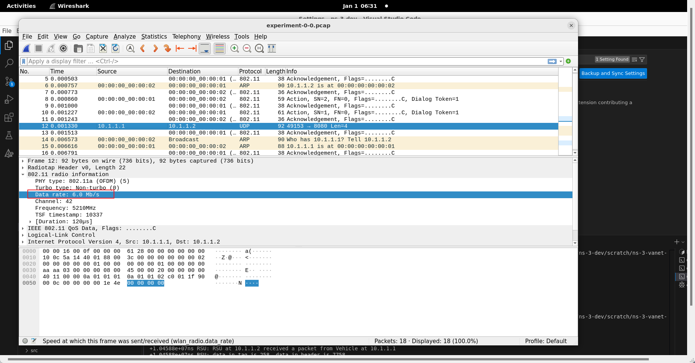

# How to use this repo

[[Prev]](How-to-start-with-vscode.md) [[中文]](zh/How-to-use-this-repo_zh_CN.md)

## Git clone this project in the `scratch` directory of ns-3 project

```shell
cd /path/to/ns-3/project/scratch
git clone https://github.com/paigeman/ns-3-vanet-scratch.git
```

## Rebuild the ns-3 project

In Visual Studio Code, you can achieve it by doing this:


## How to configure SUMO related parameters

For some parameters like simulation area, vehicle density, and vehicle speed, these are provided by Eclipse SUMO.

SUMO offers a script named `traceExporter.py` to generates a ns2 mobility file and generates a ns2 configuration file. You can follow Ref. [1-17] to generate necessary input files for this repo.

For example, if you use `traceExporter.py` like this:

```shell
python traceExporter.py --fcd-input sumoTrace.xml --ns2mobility-output ns2mobility.tcl --ns2config-output config.tcl
```

This repo need `ns2mobility.tcl` and `config.tcl` .

Then you can replace the values of `traceFile` and `configFile` in `.vscode/settings.json` file:


The part where the parameters `traceFile` and `configFile` are defined and parsed in the code `experiment.cc` is:

```cpp
// experiment.cc
std::string traceFile;
std::string configFile;
CommandLine cmd(__FILE__);
cmd.AddValue("traceFile", "Ns2 movement trace file", traceFile);
cmd.AddValue("configFile", "Configuration file", configFile);
cmd.Parse(argc, argv);
```

After the program receives the values of these two parameters, `traceFile` can be processed using the file parsing methods provided by ns-3. For `configFile`, however, you need to define your own corresponding parsing method.

Here, we first introduce how `configFile` is parsed, as most parameters are set by parsing this file, while `traceFile` only stores the movement trajectories of vehicles.

```cpp
// experiment.cc

uint32_t nodeNum;
double duration;
double start;
std::unordered_map<std::string, std::string> configMap;
ParseConfigFile(configFile, configMap);
// set the number of nodes
nodeNum = std::stoi(configMap["opt(nn)"]);
nodeNum = 1;
// start time of simulation
start = std::stod(configMap["opt(start)"]);
// end time of simulation
duration = std::stod(configMap["opt(stop)"]);

// parse configFile
static void
ParseConfigFile(const std::string& fileName,
                std::unordered_map<std::string, std::string>& configMap)
{
    std::ifstream file(fileName);
    if (!file.is_open())
    {
        std::cerr << "Error opening file: " << fileName << std::endl;
        return;
    }
    std::string line;
    while (std::getline(file, line))
    {
        if (line.empty())
        {
            continue;
        }
        // ignore comments
        size_t pos_sharp = line.find_first_of('#');
        if (pos_sharp != std::string::npos)
        {
            line = line.substr(0, pos_sharp);
        }
        while (!line.empty() && isblank(line[0]))
        {
            line.erase(0, 1); // Removes blank spaces at the beginning of the line
        }
        while (!line.empty() && isblank(line[line.size() - 1]))
        {
            line.erase(line.size() - 1, 1); // Removes blank spaces from at end of line
        }
        std::istringstream iss(line);
        std::string keyword;
        std::string key;
        std::string value;
        iss >> keyword;
        // if line is not starting with set, skip this line
        if (keyword != "set")
        {
            continue;
        }
        iss >> key >> value;
        configMap[key] = value;
    }
    file.close();
}
```

In the code above, the `ParseConfigFile` section should not require any modifications unless your requirements involve lines that do not start with `set` or cases that are not accounted for in this repository. Additionally, note that the `nodeNum` here is set to 1 after being retrieved from the configuration file. This is because, for simplicity, this repository only demonstrates communication between one vehicle and one RSU.

The `duration` can also be considered the simulation end time, as the start time is generally 0, making the end time equal to the duration.

The parsing of `traceFile` will not be elaborated further, as this process is coupled with the configuration of the mobility model.

## How to set the number of RSUs

Originally, the plan was to set the number of RSUs by passing a command-line argument to the program. However, considering that having multiple RSUs would require designing a more reasonable placement strategy, the decision was made to simplify the scenario. Because a reasonable RSU placement strategy would not only involve determining optimal RSU positions but also selecting an appropriate communication propagation model.

Therefore, although `rsuNum` is defined in `experiment.cc` to accept command-line arguments, its value is forcibly set to `1` in the subsequent code, meaning there will always be only one RSU.

In other words, you are required to pass the `rsuNum` parameter via the command line, but the value you provide will have no effect. Users are free to modify this logic if desired.

```cpp
// experiment.cc
int rsuNum;
cmd.AddValue("rsuNum", "Number of RSUs", rsuNum);
cmd.Parse(argc, argv);
rsuNum = 1;
```

## How to configure mobility models and create node containers

The following code configures the mobility model for vehicles and creates the node container:

```cpp
// experiment.cc
// Create Ns2MobilityHelper with the specified trace log file as parameter
auto ns2 = Ns2MobilityHelper(traceFile);
// Must add the following two lines code
// Create all vehicle nodes.
NodeContainer stas;
stas.Create(nodeNum);
ns2.Install(); // configure movements for each node, while reading trace file
```

The following code configures the mobility model for RSUs and creates the node container:

```cpp
// experiment.cc
// 配置RSU的移动模型
double minX = std::stod(configMap["opt(min-x)"]);
double minY = std::stod(configMap["opt(min-y)"]);
double maxX = std::stod(configMap["opt(x)"]);
double maxY = std::stod(configMap["opt(y)"]);
double width = maxX - minX;
double height = maxY - minY;
// 最简单的实现，只有一个RSU，部署在区域的中心
// 创建RSU节点
NodeContainer rsuNodes;
rsuNum = 1;
rsuNodes.Create(rsuNum);
// 自定义位置分配器，把RSU放至区域的中心
Ptr<ListPositionAllocator> positionAllocator = CreateObject<ListPositionAllocator>();
double posX = minX + width / 2;
double posY = minY + height / 2;
positionAllocator->Add(Vector(posX, posY, 0.0));
MobilityHelper mobility;
mobility.SetPositionAllocator(positionAllocator);
// RSU的mobility model配置为静态的
mobility.SetMobilityModel("ns3::ConstantPositionMobilityModel");
mobility.Install(rsuNodes);
```

The mobility model for the RSU is configured to be stationary, i.e., `ConstantPositionMobilityModel`. It also retrieves the size of the simulation area from the previously parsed configuration file, calculates the center of the area, and places the RSU at the center. Of course, this is just a simple approach and should be adjusted according to the size of the simulation area in conjunction with the propagation model.

Of course, you can also use other position allocators, such as replacing `ListPositionAllocator` with `GridPositionAllocator` . However, if you do so, some additional configurations will also be required.

The relevant references are 18 to 26.

## How to configure channel and physical layer

```cpp
// experiment.cc
YansWifiChannelHelper channel = YansWifiChannelHelper::Default();
channel.SetPropagationDelay("ns3::ConstantSpeedPropagationDelayModel");
channel.AddPropagationLoss("ns3::FixedRssLossModel", "Rss", DoubleValue(rss));
YansWifiPhyHelper phy;
// This is one parameter that matters when using FixedRssLossModel
// set it to zero; otherwise, gain will be added
phy.Set("RxGain", DoubleValue(0));
phy.SetChannel(channel.Create());
WifiHelper wifi;
wifi.SetRemoteStationManager("ns3::ConstantRateWifiManager",
                                "DataMode",
                                StringValue("OfdmRate6Mbps"),
                                "ControlMode",
                                StringValue("OfdmRate6Mbps"));
```

In the code above, `ConstantSpeedPropagationDelayModel` is the propagation delay model, `FixedRssLossModel` is the propagation loss model, `ConstantRateWifiManager` is the rate manager, and `OfdmRate6Mbps` indicates that the channel bandwidth is 6 Mbps. These parameters usually have default values if not specified. To find out about the default values, there are generally two approaches: one is to look at the code, and the other is to consult the documentation. Taking `YansWifiChannelHelper` as an example, Ref. 27 briefly mentions what its default propagation loss model and propagation delay model are.

> By default, we create a channel model with a propagation delay equal to a constant, the speed of light, and a propagation loss based on a log distance model with a reference loss of 46.6777 dB at reference distance of 1m.

In Ref. 28, it explicitly states what its default propagation loss model and propagation delay model are.

> Specifically, the default is a channel model with a propagation delay equal to a constant, the speed of light (ns3::ConstantSpeedPropagationDelayModel), and a propagation loss based on a default log distance model (ns3::LogDistancePropagationLossModel), using a default exponent of 3. Please note that the default log distance model is configured with a reference loss of 46.6777 dB at reference distance of 1m.

As for which propagation loss models and propagation delay models are implemented in ns-3, you can refer to Ref. 29.

If you want to change the propagation model, you just need to change the corresponding value in the code to the one you wish to use, for example, changing `ns3::ConstantSpeedPropagationDelayModel` to `ns3::RandomPropagationDelayModel` .

Each propagation model also has configurable attributes; take `FixedRssLossModel` as an example. You can find the attributes that can be set in the `Detailed Description` section of reference 30. Typically, these can also be obtained by looking at the `GetTypeId` function of the corresponding code:

```cpp
// experiment.cc
TypeId
FixedRssLossModel::GetTypeId()
{
    static TypeId tid = TypeId("ns3::FixedRssLossModel")
                            .SetParent<PropagationLossModel>()
                            .SetGroupName("Propagation")
                            .AddConstructor<FixedRssLossModel>()
                            .AddAttribute("Rss",
                                          "The fixed receiver Rss.",
                                          DoubleValue(-150.0),
                                          MakeDoubleAccessor(&FixedRssLossModel::m_rss),
                                          MakeDoubleChecker<double>());
    return tid;
}
```

Among them, `Rss` in the `AddAttribute` is an attribute that is allowed to be set, and this determines what string identifier you should use when setting the attribute. Note that this method also applies to other classes that have a `GetTypeId` function. When you need to set attributes through their `set` methods or the `SetAttribute` method of a `Ptr`, you either have to consult the documentation to find the settable attributes or look into the code.

As for the value of `RxGain`, this also depends on the propagation model used.

The default value of `ConstantRateWifiManager` is `OfdmRate6Mbps`, meaning the channel bandwidth is 6 Mbps. If you want to verify whether it is indeed 6 Mbps, you can enable pcap in the code:

```cpp
// experiment.cc
phy.SetPcapDataLinkType(WifiPhyHelper::DLT_IEEE802_11_RADIO);
phy.EnablePcap("experiment", vehicleDevices.Get(0));
phy.EnablePcap("experiment", rsuDevices.Get(0));
```

Then, open the generated file with Wireshark, select a packet, and examine the corresponding fields at the Physical layer:



If you want to change the channel bandwidth, you can modify the values of `DataMode` and `ControlMode`. However, the rates permitted by each IEEE 802.11 standard are predefined, for which you can refer to reference 31. Regarding the representation of each rate in the code, the author has not found any documentation that fully and accurately describes this point, but you can take a look at reference 32, which provides some description. Alternatively, readers can examine the class `WifiPhy` and other parts of the code to see if they can find corresponding rules.

## How to configure the data link layer

```cpp
// experiment.cc
WifiMacHelper mac;
mac.SetType("ns3::AdhocWifiMac");
NetDeviceContainer vehicleDevices = wifi.Install(phy, mac, stas);
NetDeviceContainer rsuDevices = wifi.Install(phy, mac, rsuNodes);
```

Note, the type of the MAC layer used here is `AdhocWifiMac`. If it's not this type, the network might fail to communicate.

## How to configure the network layer

```cpp
// experiment.cc
InternetStackHelper stack;
stack.Install(stas);
stack.Install(rsuNodes);
// 分配IP地址 一般来说够了
Ipv4AddressHelper address;
address.SetBase("10.1.1.0", "255.255.255.0");
address.Assign(vehicleDevices);
auto rsuInterfaces = address.Assign(rsuDevices);
Ipv4GlobalRoutingHelper::PopulateRoutingTables();
```

In the code above, the only part that might need to be changed is the assignment of IPv4 addresses. Generally, the parameters of the `SetBase` method of `Ipv4AddressHelper` should be set according to the scale of your simulation experiment, ensuring that there are enough IPv4 addresses to be allocated. The first parameter is the network number, and the second parameter is the subnet mask.

## How to install applications on nodes

```cpp
// experiment.cc
uint16_t rsuServerPort = 8080;
uint16_t vehicleServerPort = 8081;

// RSU应用
for (int i = 0; i < rsuNum; ++i)
{
    Ptr<RsuApp> rsuApp = CreateObject<RsuApp>(rsuServerPort, vehicleServerPort);
    rsuNodes.Get(i)->AddApplication(rsuApp);
    rsuApp->SetStartTime(Seconds(start));
    rsuApp->SetStopTime(Seconds(duration));
}

// 车辆应用
for (uint32_t i = 0; i < nodeNum; i++)
{
    Ptr<VehicleApp> vehicleApp =
        CreateObject<VehicleApp>(rsuServerPort, rsuInterfaces.GetAddress(0), vehicleServerPort);
    stas.Get(i)->AddApplication(vehicleApp);
    vehicleApp->SetStartTime(Seconds(start));
    vehicleApp->SetStopTime(Seconds(duration));
}
```

The meaning of the code snippet above is to install `VehicleApp` on each vehicle node and `RsuApp` on each RSU node, and to set the start and stop times for each application. Both `VehicleApp` and `RsuApp` are custom-defined applications.

Note that in ns-3, applications must be installed on nodes, even if the node has not been assigned an IPv4 address or configured with a network stack. For logic that needs to run continuously during the simulation, such as event generation, you might consider defining an application and installing it on the node.

## How to start simulation

```cpp
// experiment.cc
Simulator::Stop(Seconds(duration));
Simulator::Run();
Simulator::Destroy();
```

## How to customize an application

A custom application needs to inherit from the `Application` class, which is defined in the header file `ns3/application.h`.

Users need to implement custom logic within their custom application. Typically, user-defined logic can either be called directly within the inherited `StartApplication` function or invoked through setting up a series of callback functions within the inherited `StartApplication` function. The former is straightforward, but we will focus on the latter.

This callback mechanism can roughly be divided into two categories: one that is triggered at timed intervals and another that is triggered by events.

Timed triggers are generally implemented using some static member functions provided by the `Simulator` class in `ns3/simulator.h`. For specific functions available, you can refer to reference 33. Below is an example:

```cpp
// vehicle-app.cc
void
VehicleApp::StartApplication()
{
    ...
    // 调度发送
    Simulator::Schedule(Seconds(0), &VehicleApp::Send, this);
    ...
}
```

Event-triggered callbacks are generally available only in certain specific classes, such as the `Socket` class found in the `ns3/socket.h` header file that we commonly use. This class provides functions like `SetRecvCallback`, which can invoke the set callback functions when different events occur. To find out what other similar member functions the `Socket` class offers, you can refer to reference 34; they usually start with `Set` and end with `Callback`. Below is an example:

```cpp
// vehicle-app.cc
void
VehicleApp::StartApplication()
{
    ...
    m_serverSocket->SetRecvCallback(MakeCallback(&VehicleApp::HandleRead, this));
    ...
}
```

A custom application usually needs to override these member functions from its parent class: `StartApplication`, `StopApplication`, and `GetTypeId`. Among these, the last one, `GetTypeId`, typically only requires adding some metadata. You will find that many custom classes can override this function when inheriting from ns-3 provided classes. A fairly common way to write this is:

```cpp
// vehicle-app.cc
TypeId
VehicleApp::GetTypeId()
{
    static TypeId tid =
        TypeId("ns3::VehicleApp").SetParent<Application>().SetGroupName("experiment");
    return tid;
}
```

That is, specify which parent class it is in the template parameter of the `SetParent` function and indicate what the group name is in the parameter of the `SetGroupName` function. The group name can be customized; generally, one group name per experiment is sufficient.

Additionally, a custom application needs to provide an appropriate constructor. Here is an example of a constructor:

```cpp
// vehicle-app.cc
VehicleApp::VehicleApp(const uint16_t rsuServerPort,
                       const Ipv4Address& rsuIpAddress,
                       const uint16_t serverPort)
    : m_rsuServerPort(rsuServerPort),
      m_rsuIpAddress(rsuIpAddress),
      m_serverPort(serverPort)
{
}
```

It will affect the code you use to create it:

```cpp
// experiment.cc
Ptr<VehicleApp> vehicleApp =
            CreateObject<VehicleApp>(rsuServerPort, rsuInterfaces.GetAddress(0), vehicleServerPort);
```

This line of code will attempt to find a matching constructor, and if it cannot find one, it will result in an error.

## How to customize data format

This repository provides three ways to carry data:

* Writing data directly to the buffer inside a `Packet`
* Customizing a `Header`
* Customizing a `Tag`

The relevant references are 35-39.

### Writing data directly to the buffer inside a `Packet`

```cpp
// rsu-app.cc
uint32_t data = 4399;
auto buffer = reinterpret_cast<uint8_t*>(&data);
packet = Create<Packet>(buffer, 4);
```

This approach is generally not suitable for data with a more complex structure, unless you can provide your own serialization and deserialization methods. In the code above, `reinterpret_cast` is used to convert the address of `data` into a `uint8_t*` format because the `Packet` constructor requires this format.

Extracting data from a `Packet`:

```cpp
// vehicle-app.cc
auto* buffer = new uint8_t[4];
packet->CopyData(buffer, 4);
```

### Customizing a `Header`

A custom `Header` should inherit from the `Header` class in the `ns3/header.h` header file, and typically the following functions need to be overridden:

```cpp
// header-example.h
// Register this type，包含一些元数据
static TypeId GetTypeId();
// Inherited from header:
TypeId GetInstanceTypeId() const override;
// 序列化与反序列化相关
uint32_t GetSerializedSize() const override;
void Serialize(Buffer::Iterator start) const override;
uint32_t Deserialize(Buffer::Iterator start) override;
void Print(std::ostream& os) const override;
```

The implementation of `GetTypeId` has been discussed previously and will not be repeated here. The typical way to write `GetInstanceTypeId` is to return the value of a call to the `GetTypeId` function:

```cpp
// header-example.cc
TypeId HeaderExample::GetInstanceTypeId() const {
    return GetTypeId();
}
```

`Serialize` is a serialization function that converts data in the `Header` into a byte sequence. Here is an example:

```cpp
// header-example.cc
void HeaderExample::Serialize(Buffer::Iterator start) const {
    start.WriteHtonU32(m_data);
}
```

ns-3's `Buffer` provides several similar functions, for example:

```cpp
void ns3::Buffer::Iterator::WriteHtolsbU32 ( uint32_t  data ) 
void ns3::Buffer::Iterator::WriteHtonU32 ( uint32_t  data ) 
void ns3::Buffer::Iterator::WriteU32 ( uint32_t  data ) 
```

There are some differences between these sets of functions, and there is no strict requirement on which ones to use, but there is a corresponding relationship between the reading and writing functions:

```cpp
WriteHtolsb/ReadLsbtoh
WriteHton/ReadNtoh
Write/Read
```

I generally prefer to use the `WriteHton/ReadNtoh` functions, which read data in network byte order and return it in host byte order.

Additionally, ns-3 only provides methods for serializing and deserializing basic data types, specifically unsigned numbers. However, there are ways to serialize and deserialize other data types as well. Here is an example:

```cpp
void
EventMessage::Serialize(Buffer::Iterator start) const
{
    start.WriteHtonU64(*reinterpret_cast<const uint64_t*>(&(m_reporterLocation.x)));
    start.WriteHtonU64(*reinterpret_cast<const uint64_t*>(&(m_reporterLocation.y)));
    start.WriteHtonU64(*reinterpret_cast<const uint64_t*>(&(m_reporterLocation.z)));
    start.WriteHtonU64(static_cast<const uint64_t>((m_timestamp.GetNanoSeconds())));
    m_randomEvent.Serialize(start);
}
```

In the code above, `m_reporterLocation` is of type `ns3::Vector`. ns-3 does not provide a mechanism for serializing and deserializing `ns3::Vector`. However, the main data within an `ns3::Vector` consists of three coordinates: x, y, and z, which are of type `double`. We serialize data of type `double` as follows: we cast the address of the data to a pointer of type `const uint64_t*`, perform a dereferencing operation on the pointer, and then write it into the `Buffer`. This also suggests how we can serialize and deserialize other primitive data types and compound data types. Additionally, if there is some data that also inherits from `Header`, you can directly call its `Serialize` method, such as `m_randomEvent.Serialize(start);`.

`Deserialize` is the deserialization function, where the order of deserializing data must match the order in which the data was serialized. And typically, the deserialization function is written in the following format:

```cpp
// header-example.cc
uint32_t HeaderExample::Deserialize(Buffer::Iterator start) {
    Buffer::Iterator i = start;
    ...
    return i.GetDistanceFrom(start);
}
```

The `GetSerializedSize` function returns the size of the serialized data. Taking `HeadExample` as an instance, it only serializes a `uint32_t` type of data, so its `GetSerializedSize` function looks like this:

```cpp
// header-example.cc
uint32_t HeaderExample::GetSerializedSize() const {
    // uint32_t is 4 bytes
    return 4;
}
```

Additionally, note that the size returned by the `GetSerializedSize` function should match the serialization functions called within the `Serialize` function. For example, suppose a class inheriting from `ns3::Header` contains only one `uint8_t` type of data, and you want to serialize it in the previously mentioned way of "reading data in network format and returning it in host format." Since ns-3 does not officially provide a `WriteHtonU8` function for serializing single-byte data, you can use `WriteHtonU16` to serialize this data. In this case, the return value of the `GetSerializedSize` function should be 2 instead of 1.

The `Print` function is used to print the contents of an object, which means writing data to an `ostream` in your own way.

Add the custom `Header` to the `Packet` :

```cpp
// vehicle-app.cc
HeaderExample header(7758);
Ptr<Packet> packet = Create<Packet>();
packet->AddHeader(header);
```

The receiver extracts the `Header` from the `Packet` :

```cpp
// rsu-app.cc
HeaderExample header;
packet->RemoveHeader(header);
```

If the custom `Header` is an empty class, i.e., a class without any non-static data members, then even if a `ByteTag` is added to the `Packet` when sending data, the receiver will not receive this data, and the corresponding callback event will not be triggered.

### Customizing a `Tag`

Customizing a `Tag` is essentially similar to customizing a `Header`, except that you inherit from the `Tag` class in the `ns3/tag.h` header file, and the signatures of the `Serialize` and `Deserialize` functions are slightly different.

Additionally, let's elaborate a bit more on the `Serialize` and `Deserialize` functions.

The parameter of the `Serialize` function is a `TagBuffer`, which provides APIs different from those of `Buffer`, offering only a set of read and write mechanisms.

The return type of the `Deserialize` function is `void`, meaning that unlike when inheriting from `Header`, there's no need to first make a copy of the `Buffer::Iterator` before writing your logic:

```cpp
// tag-example.cc
void
TagExample::Deserialize(TagBuffer i)
{
    m_data = i.ReadU32();
}
```

Add the custom `Tag` to the `Packet` :

```cpp
// vehicle-app.cc
TagExample tag(258);
Ptr<Packet> packet = Create<Packet>();packet->AddByteTag(tag);
```

The receiver extracts the `Tag` from the `Packet` :

```cpp
// rsu-app.cc
TagExample tag;
packet->FindFirstMatchingByteTag(tag)
```

The storage and retrieval methods for `Tag` are not limited to this one; for more details, you can refer to reference 39.

### Note

* A custom `Header` should not be used alongside directly writing data to the buffer inside a `Packet`.
* A single `Packet` should not contain multiple `Header` instances.
* A custom `Tag` can be used alongside a custom `Header` , but note that the order of storing and retrieving is reversed.

## How to communicate

In ns-3, communication is similar to real life. You can choose either the UDP or TCP protocol. After selecting a protocol, you need to create a socket of that type. Put the data to be carried into the socket and finally send it to the specified IPv4 address.

```cpp
// vehicle-app.cc
Ptr<Socket> socket = Socket::CreateSocket(GetNode(), UdpSocketFactory::GetTypeId());
const InetSocketAddress remote(m_rsuIpAddress, m_rsuServerPort);
HeaderExample header(7758);
TagExample tag(258);
Ptr<Packet> packet = Create<Packet>();
packet->AddHeader(header);
packet->AddByteTag(tag);
socket->SendTo(packet, 0, remote);
```

The server typically sets up a socket bound to the corresponding port, and when data arrives, it invokes the configured callback function:

```cpp
// rsu-app.cc
m_serverSocket = Socket::CreateSocket(GetNode(), UdpSocketFactory::GetTypeId());
if (const auto local = InetSocketAddress(Ipv4Address::GetAny(), m_serverPort);
    m_serverSocket->Bind(local))
{
    NS_FATAL_ERROR("Failed to bind socket");
}
m_serverSocket->SetRecvCallback(MakeCallback(&RsuApp::HandleRead, this));
```

In the code above, the first parameter of the `InetSocketAddress` constructor can be replaced with the IPv4 address assigned to this node. Here, `Ipv4Address::GetAny()` serves a similar purpose to `0.0.0.0`.

Note that the server here is not blocking; after binding the port, it does not block to listen on the port, so there is no call to the `Listen` function.

Of course, since we have mentioned that communication in ns-3 is similar to real life, ns-3 also supports the characteristics of each protocol. For example, the broadcast mechanism of UDP:

```cpp
Ptr<Socket> socket = Socket::CreateSocket(GetNode(), UdpSocketFactory::GetTypeId());
// note: 可能会存在广播风波的问题
const InetSocketAddress broadcastAddr(Ipv4Address("255.255.255.255"), m_vehiclePort);
socket->SetAllowBroadcast(true);
Ptr<Packet> packet = Create<Packet>();
socket->SendTo(packet, 0, broadcastAddr);
```

The specific details can be found in the various socket implementations.

## References

1. [SUMO 从入门到基础 SUMO入门一篇就够了](https://blog.csdn.net/qilie_32/article/details/127201612)
2. [使用OSM生成路网](https://www.bilibili.com/video/BV1H7411F76B/?p=4&vd_source=95cbfe5a1adb7fe10e7dfdf77f3ea7d8)
3. [SUMO仿真教程（4）—— 由openstreetmap生成路网文件](https://blog.csdn.net/weixin_50632459/article/details/115449397)
4. [（二）osm格式文件如何导入sumo（包括建筑物边界的生成）](https://blog.csdn.net/lianginging/article/details/137744327)
5. [polyconvert](https://sumo.dlr.de/docs/polyconvert.html)
6. [How do I maintain a constant number of vehicles in the net?](https://sumo.dlr.de/docs/FAQ.html#how_do_i_maintain_a_constant_number_of_vehicles_in_the_net)
7. [how can I set the vehicle to drive at a constant speed in sumo file?](https://stackoverflow.com/questions/64533948/how-can-i-set-the-vehicle-to-drive-at-a-constant-speed-in-sumo-file)
8. [Automatically generating a vehicle type](https://sumo.dlr.de/docs/Tools/Trip.html#automatically_generating_a_vehicle_type)
9. [`***.sumo.cfg` 配置文件生成](https://github.com/Internet-of-Vehicles-Code/Veins_SUMO_OMNeTpp?tab=readme-ov-file#211-%E4%BD%BF%E7%94%A8netconvert%E8%BD%AC%E6%8D%A2%E5%B7%A5%E5%85%B7)
10. [Strange behavior when using randomTrips.py](https://github.com/eclipse-sumo/sumo/issues/15306)
11. [DFROUTER speed conflict](https://github.com/eclipse-sumo/sumo/issues/6951#issuecomment-620675996)
12. [sumo+ns3](https://blog.csdn.net/LUYAO_LY/article/details/117383835)
13. [Trace File Generation](https://sumo.dlr.de/docs/Tutorials/Trace_File_Generation.html)
14. [Vanet：生成ns3仿真所需的车辆移动文件（*.tcl）](https://blog.csdn.net/hanweixiao/article/details/122407194)
15. [SUMO产生trace并在NS3中调用实例](https://blog.csdn.net/lovehuishouzan/article/details/96751782)
16. [sdsxpln/IoTWNT](https://github.com/sdsxpln/IoTWNT)
17. [TraceExporter](https://sumo.dlr.de/docs/Tools/TraceExporter.html)
18. [Thread: [sumo-user] Add RSU on road map](https://sourceforge.net/p/sumo/mailman/sumo-user/thread/CAHJk9CcoH3XHojVvfe+JHcUX+zsLYcnOxd14VW1daJd2nKObeg@mail.gmail.com/)
19. [ns3：搭建vanet的移动模型](https://blog.csdn.net/hanweixiao/article/details/122407904)
20. <https://github.com/ms-van3t-devs/ms-van3t/blob/a40ccaa833b8e06569c92c594703c4239ddc2a29/src/automotive/examples/v2i-areaSpeedAdvisor-80211p.cc#L1-L368>
21. [VANET projects examples using ns3](https://ns3simulation.com/vanet-projects-examples-using-ns3/)
22. <https://github.com/cqu-bdsc/NS3-example/blob/30f4d87fdb45c43305df4e7c4b6534ec0a2c9bcd/scratch/vanet-demo-case-3.cc#L1-L729>
23. [How can I add a Road Side Unit into a NS-2 and Sumo Simulation](https://stackoverflow.com/questions/47545100/how-can-i-add-a-road-side-unit-into-a-ns-2-and-sumo-simulation)
24. [RSU (road side unit) implementation in VANET using ns-3](https://groups.google.com/g/ns-3-users/c/GU5yhRKYKwc)
25. [物联网与无线网络实验资源](https://github.com/sdsxpln/IoTWNT)
26. [ns3::PositionAllocator Class Reference](https://www.nsnam.org/docs/release/3.42/doxygen/df/d7b/classns3_1_1_position_allocator.html)
27. [Default()](https://www.nsnam.org/docs/release/3.42/doxygen/de/d95/classns3_1_1_yans_wifi_channel_helper.html#abf7de2e0916e7188a8434a363cb96183)
28. [34.2.1.1. YansWifiChannelHelper](https://www.nsnam.org/docs/models/html/wifi-user.html#yanswifichannelhelper)
29. [28. Propagation](https://www.nsnam.org/docs/models/html/propagation.html)
30. [Detailed Description](https://www.nsnam.org/docs/release/3.42/doxygen/d0/d39/classns3_1_1_fixed_rss_loss_model.html#details)
31. [802.11物理层技术讲解](https://blog.csdn.net/weixin_42353331/article/details/86504529)
32. [transmission rate](https://groups.google.com/g/ns-3-users/c/ymNOB59mNqU/m/n8GvsoY95MYJ)
33. [ns3::Simulator Class Reference](https://www.nsnam.org/docs/release/3.42/doxygen/dd/de5/classns3_1_1_simulator.html)
34. [ns3::Socket Class Reference](https://www.nsnam.org/docs/release/3.42/doxygen/d8/db5/classns3_1_1_socket.html)
35. [Miscellaneous](https://www.nsnam.org/support/faq/miscellaneous/)
36. [ns3在packet中加入自定义数据](https://blog.csdn.net/information_seeker/article/details/103549631)
37. [How do I send personalized packets between a client and a server?](https://groups.google.com/g/ns-3-users/c/CPi4WDJWfuY)
38. [ns3::TagBuffer Class Reference](https://www.nsnam.org/docs/release/3.42/doxygen/d8/d95/classns3_1_1_tag_buffer.html)
39. [ns3::Packet Class Reference](https://www.nsnam.org/docs/release/3.42/doxygen/d8/df4/classns3_1_1_packet.html)
