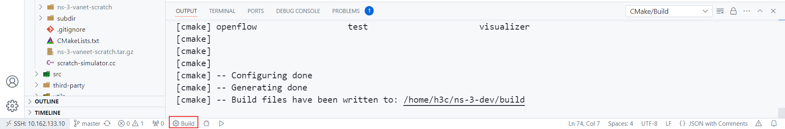
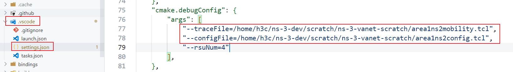
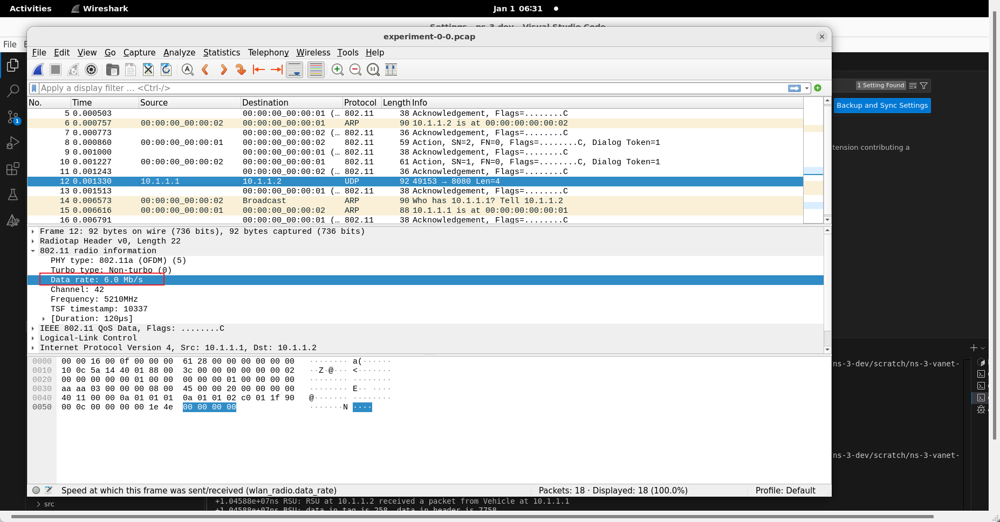

# 如何使用这个仓库

[[上一篇]](How-to-start-with-vscode_zh_CN.md) [[English]](../How-to-use-this-repo.md)

## 在 ns-3 项目的 `scratch` 目录下使用 Git 下载本仓库

```shell
cd /path/to/ns-3/project/scratch
git clone https://github.com/paigeman/ns-3-vanet-scratch.git
```

## 重新构建 ns-3 项目

在 Visual Studio Code 中，你可以这么做：



## 如何配置 SUMO 相关的参数

对于一些参数，比如说仿真区域、车辆密度和车辆速度，它们是由 Eclipse SUMO 提供的。

SUMO 提供了一个名为 `traceExporter.py` 的脚本，用于生成 ns2 移动性文件和 ns2 配置文件。你可以按照参考文献[1-17]来为本仓库生成必要的输入文件。

比如，如果你像这样使用 `traceExporter.py` ：

```shell
python traceExporter.py --fcd-input sumoTrace.xml --ns2mobility-output ns2mobility.tcl --ns2config-output config.tcl
```

本仓库需要的是 `ns2mobility.tcl` 和 `config.tcl` 。

然后你可以在 `.vscode/settings.json` 文件里替换 `traceFile` 和 `configFile` 的值：



`traceFile` 和 `configFile` 这两个参数在代码 `experiment.cc` 中定义和解析的部分是：

```cpp
// experiment.cc
std::string traceFile;
std::string configFile;
CommandLine cmd(__FILE__);
cmd.AddValue("traceFile", "Ns2 movement trace file", traceFile);
cmd.AddValue("configFile", "Configuration file", configFile);
cmd.Parse(argc, argv);
```

程序在接受到这两个参数的值后，对于 `traceFile` ，ns-3 官方有提供解析文件的方法，对于 `configFile` ，则需要自己定义对应的方法。

这里先介绍是怎么解析 `configFile` 的，因为大部分参数都是通过解析这个文件设置的， `traceFile` 只是保存了车辆的移动轨迹。

```cpp
// experiment.cc

uint32_t nodeNum;
double duration;
double start;
std::unordered_map<std::string, std::string> configMap;
ParseConfigFile(configFile, configMap);
// 设置节点数量
nodeNum = std::stoi(configMap["opt(nn)"]);
nodeNum = 1;
// 开始时间
start = std::stod(configMap["opt(start)"]);
// 设置duration
duration = std::stod(configMap["opt(stop)"]);

// 解析配置文件
static void
ParseConfigFile(const std::string& fileName,
                std::unordered_map<std::string, std::string>& configMap)
{
    std::ifstream file(fileName);
    if (!file.is_open())
    {
        std::cerr << "Error opening file: " << fileName << std::endl;
        return;
    }
    std::string line;
    while (std::getline(file, line))
    {
        if (line.empty())
        {
            continue;
        }
        // 忽略注释
        size_t pos_sharp = line.find_first_of('#');
        if (pos_sharp != std::string::npos)
        {
            line = line.substr(0, pos_sharp);
        }
        // 去除行首和行尾的空白字符
        while (!line.empty() && isblank(line[0]))
        {
            line.erase(0, 1); // Removes blank spaces at the beginning of the line
        }
        while (!line.empty() && isblank(line[line.size() - 1]))
        {
            line.erase(line.size() - 1, 1); // Removes blank spaces from at end of line
        }
        std::istringstream iss(line);
        std::string keyword;
        std::string key;
        std::string value;
        iss >> keyword;
        // 如果不是set打头直接跳过
        if (keyword != "set")
        {
            continue;
        }
        iss >> key >> value;
        configMap[key] = value;
    }
    file.close();
}
```

上面的代码， `ParseConfigFile` 部分应该没有什么需要变动的，除非你的需求需要用到里面的一些不是以 `set` 打头的行或者碰到本仓库没有考虑到的情况。另外，注意到这里的 `nodeNum` 在从配置文件中取值后被设置为了1，这是因为本仓库为了简单只演示了一个车辆和一个 RSU 通信的情况。 `duration` 也可以被认为是仿真结束时间，因为一般情况下开始时间都是0，所以结束时间就是持续时间。

解析 `traceFile` 就不多叙述了，因为这一过程被耦合进配置移动模型了。

## 如何设置 RSU 的数量

本来是打算通过传递命令行参数给程序设置 RSU 的数量，但是考虑到如果有多个 RSU ，要设计一个比较合理的 RSU 放置方案。不仅需要合理的放置 RSU ，还要选择合适的通信传播模型。所以虽然在 `experiment.cc` 中设置了 `rsuNum` 接受命令行参数的传递，但为了简单考虑，在后面的代码中强制设置了 `rsuNum` 的值为1，即只有一个 RSU 。也就是说你必须传递命令行参数给 `rsuNum` ，但你传递的参数没有作用。关于这一个逻辑，用户可以自行修改。

```cpp
// experiment.cc
int rsuNum;
cmd.AddValue("rsuNum", "Number of RSUs", rsuNum);
cmd.Parse(argc, argv);
rsuNum = 1;
```

## 怎么配置移动模型和创建节点容器

这里的代码是车辆的移动模型的配置和节点容器的创建：

```cpp
// experiment.cc
// Create Ns2MobilityHelper with the specified trace log file as parameter
auto ns2 = Ns2MobilityHelper(traceFile);
// Must add the following two lines code
// Create all vehicle nodes.
NodeContainer stas;
stas.Create(nodeNum);
ns2.Install(); // configure movements for each node, while reading trace file
```

这里的代码是 RSU 的移动模型的配置和节点容器的创建：

```cpp
// experiment.cc
// 配置RSU的移动模型
double minX = std::stod(configMap["opt(min-x)"]);
double minY = std::stod(configMap["opt(min-y)"]);
double maxX = std::stod(configMap["opt(x)"]);
double maxY = std::stod(configMap["opt(y)"]);
double width = maxX - minX;
double height = maxY - minY;
// 最简单的实现，只有一个RSU，部署在区域的中心
// 创建RSU节点
NodeContainer rsuNodes;
rsuNum = 1;
rsuNodes.Create(rsuNum);
// 自定义位置分配器，把RSU放至区域的中心
Ptr<ListPositionAllocator> positionAllocator = CreateObject<ListPositionAllocator>();
double posX = minX + width / 2;
double posY = minY + height / 2;
positionAllocator->Add(Vector(posX, posY, 0.0));
MobilityHelper mobility;
mobility.SetPositionAllocator(positionAllocator);
// RSU的mobility model配置为静态的
mobility.SetMobilityModel("ns3::ConstantPositionMobilityModel");
mobility.Install(rsuNodes);
```

RSU 的移动模型被配置为静止不动的，即 `ConstantPositionMobilityModel` 。它还从前面解析的配置文件中获取了仿真区域的大小，计算出了区域中心的位置，并把 RSU 放置在了区域的中心。当然，这只是一种简单的处理方式，是需要根据仿真区域大小配合传播模型使用的。当然你也可以使用其它位置分配器，比如把 `ListPositionAllocator` 更换成 `GridPositionAllocator` 。当然如果这样做，还需要其它的一些配置。

相关的参考文献是18到26。

## 如何配置信道和物理层

```cpp
// experiment.cc
YansWifiChannelHelper channel = YansWifiChannelHelper::Default();
channel.SetPropagationDelay("ns3::ConstantSpeedPropagationDelayModel");
channel.AddPropagationLoss("ns3::FixedRssLossModel", "Rss", DoubleValue(rss));
YansWifiPhyHelper phy;
// This is one parameter that matters when using FixedRssLossModel
// set it to zero; otherwise, gain will be added
phy.Set("RxGain", DoubleValue(0));
phy.SetChannel(channel.Create());
WifiHelper wifi;
wifi.SetRemoteStationManager("ns3::ConstantRateWifiManager",
                                "DataMode",
                                StringValue("OfdmRate6Mbps"),
                                "ControlMode",
                                StringValue("OfdmRate6Mbps"));
```

上面的代码中 `ConstantSpeedPropagationDelayModel` 是传播延迟模型， `FixedRssLossModel` 是传播损失模型， `ConstantRateWifiManager` 是速率管理器， `OfdmRate6Mbps` 则表述信道带宽是6Mbps。这些参数如果不指定，一般会有默认值。关于默认值怎么查看，一般有两种方式，一是看代码，二是看文档。以 `YansWifiChannelHelper` 为例，参考文献27简要的提到了它默认的传播损失模型和传播延迟模型是什么。

> By default, we create a channel model with a propagation delay equal to a constant, the speed of light, and a propagation loss based on a log distance model with a reference loss of 46.6777 dB at reference distance of 1m.

在参考文献28中，更是直接写明了它默认的传播损失模型和传播延迟模型是什么。

> Specifically, the default is a channel model with a propagation delay equal to a constant, the speed of light (ns3::ConstantSpeedPropagationDelayModel), and a propagation loss based on a default log distance model (ns3::LogDistancePropagationLossModel), using a default exponent of 3. Please note that the default log distance model is configured with a reference loss of 46.6777 dB at reference distance of 1m.

至于 ns-3 实现了哪些传播损失模型和传播延迟模型，可以看参考文献29。

如果想要更换传播模型，只需要把代码中对应的值改成你想要更换的值即可，比如把 `ns3::ConstantSpeedPropagationDelayModel` 改成 `ns3::RandomPropagationDelayModel` 。

每个传播模型也有所允许设置的属性，以 `FixedRssLossModel` 为例，可以在参考文献30的 `Detailed Description` 部分找到可以设置的属性。一般这种还可以通过查看对应代码的 `GetTypeId` 函数获取：

```cpp
// experiment.cc
TypeId
FixedRssLossModel::GetTypeId()
{
    static TypeId tid = TypeId("ns3::FixedRssLossModel")
                            .SetParent<PropagationLossModel>()
                            .SetGroupName("Propagation")
                            .AddConstructor<FixedRssLossModel>()
                            .AddAttribute("Rss",
                                          "The fixed receiver Rss.",
                                          DoubleValue(-150.0),
                                          MakeDoubleAccessor(&FixedRssLossModel::m_rss),
                                          MakeDoubleChecker<double>());
    return tid;
}
```

其中 `AddAttribute` 中的 `Rss` 就是所允许设置的属性，这也决定了你在设置属性时要使用什么字符串标识。注意，这种方法对于其它有 `GetTypeId` 函数的类也是适用的。当你需要通过它们的 `set` 方法或者 `Ptr` 的 `SetAttribute` 方法设置属性时，要么就是去看文档找可以设置的属性，要么就是看代码。

至于 `RxGain` 的值，这个也和使用的传播模型有关。

`ConstantRateWifiManager` 的默认值便是 `OfdmRate6Mbps` ，也即信道带宽是6Mbps。如果想要验证是否是6Mbps，可以在代码中开启 pcap ：

```cpp
// experiment.cc
phy.SetPcapDataLinkType(WifiPhyHelper::DLT_IEEE802_11_RADIO);
phy.EnablePcap("experiment", vehicleDevices.Get(0));
phy.EnablePcap("experiment", rsuDevices.Get(0));
```

再用 Wireshark 打开生成的文件选择一个数据包后查看物理层对应字段：



如果想要更换信道带宽，可以更换 `DataMode` 和 `ControlMode` 的值。但是 IEEE 802.11 每种标准所允许使用的速率是规定好了的，这一点可以参考参考文献31。至于每种速率在代码中的表示，笔者没有找到有相关文档完整准确的描述了这一点，但是可以看看参考文献32，这里稍微有些描述。或者读者可以看看类 `WifiPhy` 和其它代码，看看是否能从中找到对应的规则。

## 如何配置数据链路层

```cpp
// experiment.cc
WifiMacHelper mac;
mac.SetType("ns3::AdhocWifiMac");
NetDeviceContainer vehicleDevices = wifi.Install(phy, mac, stas);
NetDeviceContainer rsuDevices = wifi.Install(phy, mac, rsuNodes);
```

注意，这里 MAC 层的类型用的是 `AdhocWifiMac` 。如果不是这个类型，网络可能会无法通信。

## 如何配置网络层

```cpp
// experiment.cc
InternetStackHelper stack;
stack.Install(stas);
stack.Install(rsuNodes);
// 分配IP地址 一般来说够了
Ipv4AddressHelper address;
address.SetBase("10.1.1.0", "255.255.255.0");
address.Assign(vehicleDevices);
auto rsuInterfaces = address.Assign(rsuDevices);
Ipv4GlobalRoutingHelper::PopulateRoutingTables();
```

上面的代码中，唯一可能需要变动的地方是分配 IPv4 地址。一般来说 `Ipv4AddressHelper` 的 `SetBase` 方法的参数要根据你的仿真实验的规模来设置，要确保 IPv4 地址足够分配。第一个参数是网络号，第二个参数是子网掩码。

## 如何把应用安装在节点上

```cpp
// experiment.cc
uint16_t rsuServerPort = 8080;
uint16_t vehicleServerPort = 8081;

// RSU应用
for (int i = 0; i < rsuNum; ++i)
{
    Ptr<RsuApp> rsuApp = CreateObject<RsuApp>(rsuServerPort, vehicleServerPort);
    rsuNodes.Get(i)->AddApplication(rsuApp);
    rsuApp->SetStartTime(Seconds(start));
    rsuApp->SetStopTime(Seconds(duration));
}

// 车辆应用
for (uint32_t i = 0; i < nodeNum; i++)
{
    Ptr<VehicleApp> vehicleApp =
        CreateObject<VehicleApp>(rsuServerPort, rsuInterfaces.GetAddress(0), vehicleServerPort);
    stas.Get(i)->AddApplication(vehicleApp);
    vehicleApp->SetStartTime(Seconds(start));
    vehicleApp->SetStopTime(Seconds(duration));
}
```

上面这段代码的意思就是每个车辆节点上都安装 `VehicleApp` 和每个 RSU 节点上都安装 `RsuApp` ，并设置每个应用的开始和结束时间。 `VehicleApp` 和 `RsuApp` 都是自定义的应用。

注意在 ns-3 中，应用是必须要安装在节点上的，即使这个节点没有分配 IPv4 地址和配置网络栈。对于一些必须在仿真期间一直执行的逻辑，比如说事件的生成，可以考虑定义一个应用并安装在节点上。

## 如何开始仿真

```cpp
// experiment.cc
Simulator::Stop(Seconds(duration));
Simulator::Run();
Simulator::Destroy();
```

## 如何自定义应用

自定义应用需要继承 `Application` 类，这个类在 `ns3/application.h` 头文件中。

用户需要自定义逻辑在自定义应用中。一般来说，用户自定义的逻辑，要么在继承得来的 `StartApplication` 函数里直接被调用，要么在继承得来的 `StartApplication` 函数里通过设置一系列回调函数从而被调用。前者浅显易懂，我们主要关注后者。

这种回调机制也大概可以分为两类：一类是定时触发，一类是事件触发。

定时触发一般通过 `ns3/simulator.h` 中的 `Simulator` 类提供的一些静态成员函数实现，具体有哪些函数可以阅读参考文献33，下面是一个例子：

```cpp
// vehicle-app.cc
void
VehicleApp::StartApplication()
{
    ...
    // 调度发送
    Simulator::Schedule(Seconds(0), &VehicleApp::Send, this);
    ...
}
```

事件触发一般只有某些具体的类才有，比如我们常用的 `ns3/socket.h` 头文件里的 `Socket` 类。这个类提供了诸如 `SetRecvCallback` 之类的函数，可以在不同的事件发生时调用所设置的回调函数。关于 `Socket` 类还提供了哪些类似的成员函数，可以阅读参考文献34，一般都是以 `Set` 打头， `Callback` 结尾。下面是一个例子：

```cpp
// vehicle-app.cc
void
VehicleApp::StartApplication()
{
    ...
    m_serverSocket->SetRecvCallback(MakeCallback(&VehicleApp::HandleRead, this));
    ...
}
```

自定义应用一般要重写来自父类的这几个成员函数： `StartApplication` 、 `StopApplication` 和 `GetTypeId` 。其中，最后一个 `GetTypeId` 一般只需添加一些元数据。并且，你会发现挺多自定义的类在继承 ns-3 提供的类时都可以重写这个函数。比较普适的一种写法是：

```cpp
// vehicle-app.cc
TypeId
VehicleApp::GetTypeId()
{
    static TypeId tid =
        TypeId("ns3::VehicleApp").SetParent<Application>().SetGroupName("experiment");
    return tid;
}
```

即在 `SetParent` 函数的泛型参数中指明父类是哪一个和在 `SetGroupName` 的参数中指明组名是什么，组名是可以自定义的，一般一个实验一个组名即可。

另外自定义应用需要提供合适的构造函数，以下面的构造函数为例：

```cpp
// vehicle-app.cc
VehicleApp::VehicleApp(const uint16_t rsuServerPort,
                       const Ipv4Address& rsuIpAddress,
                       const uint16_t serverPort)
    : m_rsuServerPort(rsuServerPort),
      m_rsuIpAddress(rsuIpAddress),
      m_serverPort(serverPort)
{
}
```

它会影响你创建它时使用的代码：

```cpp
// experiment.cc
Ptr<VehicleApp> vehicleApp =
            CreateObject<VehicleApp>(rsuServerPort, rsuInterfaces.GetAddress(0), vehicleServerPort);
```

这行代码是会去找到匹配的构造函数的，如果找不到就会报错。

## 如何自定义数据格式

本仓库提供了三种携带数据的方式：

* 直接往 `Packet` 里的缓冲区写数据
* 自定义 `Header`
* 自定义 `Tag`

相关的参考文献是35-39。

### 直接往 `Packet` 里的缓冲区写数据

```cpp
// rsu-app.cc
uint32_t data = 4399;
auto buffer = reinterpret_cast<uint8_t*>(&data);
packet = Create<Packet>(buffer, 4);
```

这种方式一般不适合格式比较复杂的数据，除非你可以自己提供一套序列化和反序列化的方法。上面的代码中 `reinterpret_cast` 作用是把 `data` 的地址转换为 `uint8_t*` 格式，因为 `Packet` 的构造函数要求的是这种格式。

从 `Packet` 里取数据：

```cpp
// vehicle-app.cc
auto* buffer = new uint8_t[4];
packet->CopyData(buffer, 4);
```

### 自定义 `Header`

自定义 `Header` 要继承 `ns3/header.h` 头文件里的 `Header` 类，并且一般要重写以下函数：

```cpp
// header-example.h
// Register this type，包含一些元数据
static TypeId GetTypeId();
// Inherited from header:
TypeId GetInstanceTypeId() const override;
// 序列化与反序列化相关
uint32_t GetSerializedSize() const override;
void Serialize(Buffer::Iterator start) const override;
uint32_t Deserialize(Buffer::Iterator start) override;
void Print(std::ostream& os) const override;
```

其中 `GetTypeId` 怎么写，我们在前面讲过，这里不再重复。 `GetInstanceTypeId` 的写法一般是返回 `GetTypeId` 函数的调用值：

```cpp
// header-example.cc
TypeId HeaderExample::GetInstanceTypeId() const {
    return GetTypeId();
}
```

`Serialize` 是序列化函数，可以把 `Header` 里的数据转换成字节序列。下面是一个例子：

```cpp
// header-example.cc
void HeaderExample::Serialize(Buffer::Iterator start) const {
    start.WriteHtonU32(m_data);
}
```

ns-3 的 `Buffer` 提供了几套相近的函数，比如：

```cpp
void ns3::Buffer::Iterator::WriteHtolsbU32 ( uint32_t  data ) 
void ns3::Buffer::Iterator::WriteHtonU32 ( uint32_t  data ) 
void ns3::Buffer::Iterator::WriteU32 ( uint32_t  data ) 
```

这几套函数之间有一定的区别，但对于使用哪个没有要求，但是读和写的函数之间是有对应关系的：

```cpp
WriteHtolsb/ReadLsbtoh
WriteHton/ReadNtoh
Write/Read
```

笔者一般习惯使用 `WriteHton/ReadNtoh` ，这套函数是以网络格式读取数据，并以主机格式返回数据的。

另外， ns-3 只提供了序列化和反序列化基础数据的方式，更具体的来说，只提供了序列化和反序列化无符号数的方式。不过对于其它数据类型，也是有办法进行序列化和反序列化的。下面是一个例子：

```cpp
void
EventMessage::Serialize(Buffer::Iterator start) const
{
    start.WriteHtonU64(*reinterpret_cast<const uint64_t*>(&(m_reporterLocation.x)));
    start.WriteHtonU64(*reinterpret_cast<const uint64_t*>(&(m_reporterLocation.y)));
    start.WriteHtonU64(*reinterpret_cast<const uint64_t*>(&(m_reporterLocation.z)));
    start.WriteHtonU64(static_cast<const uint64_t>((m_timestamp.GetNanoSeconds())));
    m_randomEvent.Serialize(start);
}
```

上面的代码中 `m_reporterLocation` 是 `ns3::Vector` 类型的， ns-3 没有提供序列化和反序列化 `ns3::Vector` 的机制。但是 `ns3::Vector` 里面主要的数据是x、y和z三个坐标，它们是 `double` 类型的。我们是这么序列化 `double` 类型的数据的：把数据的地址转换成 `const uint64_t*` 类型的指针，再对指针进行取值运算，再写入 `Buffer` 中。这也启示我们可以如何序列化和反序列化一些其它的基础类型的数据和复合类型的数据。另外，如果有某种数据也是继承了 `Header` 的，那么可以直接调用它的 `Serialize` 方法，比如 `m_randomEvent.Serialize(start);` 。

`Deserialize` 是反序列化函数，里面反序列化数据的顺序要和序列化数据的顺序一样。并且一般会按照下面的格式编写反序列化函数：

```cpp
// header-example.cc
uint32_t HeaderExample::Deserialize(Buffer::Iterator start) {
    Buffer::Iterator i = start;
    ...
    return i.GetDistanceFrom(start);
}
```

`GetSerializedSize` 函数返回所序列化的数据的大小，以 `HeadExample` 为例，它只序列化了一个 `uint32_t` 类型的数据，所以它的 `GetSerializedSize` 函数是这样的：

```cpp
// header-example.cc
uint32_t HeaderExample::GetSerializedSize() const {
    // uint32_t is 4 bytes
    return 4;
}
```

`Print` 函数的作用是打印对象内容，就是往 `ostream` 里按照自己的方式写数据即可。

自定义的 `Header` 添加到 `Packet` 中：

```cpp
// vehicle-app.cc
HeaderExample header(7758);
Ptr<Packet> packet = Create<Packet>();
packet->AddHeader(header);
```

接收者从 `Packet` 中取出 `Header` ：

```cpp
// rsu-app.cc
HeaderExample header;
packet->RemoveHeader(header);
```

### 自定义 `Tag`

自定义 `Tag` 和自定义 `Header` 操作基本类似，除了继承的是 `ns3/tag.h` 头文件里的 `Tag` 类，以及 `Serialize` 和 `Deserialize` 函数签名稍微不同。

此外，我们稍微对 `Serialize` 和 `Deserialize` 函数多提几嘴。

`Serialize` 函数的参数是 `TagBuffer` ，它提供的 API 和 `Buffer` 是不同的，只有一套读写机制。

`Deserialize` 函数的返回类型是 `void` ，这意味着不需要像继承 `Header` 一样先对 `Buffer::Iterator` 拷贝一下再编写逻辑：

```cpp
// tag-example.cc
void
TagExample::Deserialize(TagBuffer i)
{
    m_data = i.ReadU32();
}
```

自定义的 `Tag` 添加到 `Packet` 中：

```cpp
// vehicle-app.cc
TagExample tag(258);
Ptr<Packet> packet = Create<Packet>();packet->AddByteTag(tag);
```

接收者从 `Packet` 中取出 `Tag` ：

```cpp
// rsu-app.cc
TagExample tag;
packet->FindFirstMatchingByteTag(tag)
```

`Tag` 的存放方式和获取方式不只这一种，具体的可以阅读参考文献39。

### 注意

* 自定义 `Header` 不能和直接往 `Packet` 里的缓冲区写数据一起使用
* 一个 `Packet` 里不能存放多个 `Header`
* 自定义 `Tag` 可以和自定义 `Header` 一起使用，但要注意存放和获取的顺序是颠倒的

## 如何通信

ns-3 中的通信和现实生活是类似的，你可以选择 UDP 或者 TCP 协议。选择好协议后，你需要创建该类型的套接字。把需要携带的数据放进套接字中，最后发送出去到指定 IPv4 地址。

```cpp
// vehicle-app.cc
Ptr<Socket> socket = Socket::CreateSocket(GetNode(), UdpSocketFactory::GetTypeId());
const InetSocketAddress remote(m_rsuIpAddress, m_rsuServerPort);
HeaderExample header(7758);
TagExample tag(258);
Ptr<Packet> packet = Create<Packet>();
packet->AddHeader(header);
packet->AddByteTag(tag);
socket->SendTo(packet, 0, remote);
```

服务端一般是设置一个套接字绑定对应端口，当有数据到达时，会调用设置的回调函数：

```cpp
// rsu-app.cc
m_serverSocket = Socket::CreateSocket(GetNode(), UdpSocketFactory::GetTypeId());
if (const auto local = InetSocketAddress(Ipv4Address::GetAny(), m_serverPort);
    m_serverSocket->Bind(local))
{
    NS_FATAL_ERROR("Failed to bind socket");
}
m_serverSocket->SetRecvCallback(MakeCallback(&RsuApp::HandleRead, this));
```

上面的代码中 `InetSocketAddress` 的构造器的第一个参数可以更换为分配给此节点的 IPv4 地址，这里 `Ipv4Address::GetAny()` 的作用和 `0.0.0.0` 的作用是类似的。

注意这里的服务端不是阻塞式的，在绑定端口后，没有阻塞地监听端口，所以这里没有调用 `Listen` 函数。

当然，既然说过 ns-3 的通信和现实生活是类似的，那么 ns-3 也支持每种协议的特性。比如 UDP 的广播机制：

```cpp
Ptr<Socket> socket = Socket::CreateSocket(GetNode(), UdpSocketFactory::GetTypeId());
// note: 可能会存在广播风波的问题
const InetSocketAddress broadcastAddr(Ipv4Address("255.255.255.255"), m_vehiclePort);
socket->SetAllowBroadcast(true);
Ptr<Packet> packet = Create<Packet>();
socket->SendTo(packet, 0, broadcastAddr);
```

具体的内容可以查看各种套接字实现。

## References

1. [SUMO 从入门到基础 SUMO入门一篇就够了](https://blog.csdn.net/qilie_32/article/details/127201612)
2. [使用OSM生成路网](https://www.bilibili.com/video/BV1H7411F76B/?p=4&vd_source=95cbfe5a1adb7fe10e7dfdf77f3ea7d8)
3. [SUMO仿真教程（4）—— 由openstreetmap生成路网文件](https://blog.csdn.net/weixin_50632459/article/details/115449397)
4. [（二）osm格式文件如何导入sumo（包括建筑物边界的生成）](https://blog.csdn.net/lianginging/article/details/137744327)
5. [polyconvert](https://sumo.dlr.de/docs/polyconvert.html)
6. [How do I maintain a constant number of vehicles in the net?](https://sumo.dlr.de/docs/FAQ.html#how_do_i_maintain_a_constant_number_of_vehicles_in_the_net)
7. [how can I set the vehicle to drive at a constant speed in sumo file?](https://stackoverflow.com/questions/64533948/how-can-i-set-the-vehicle-to-drive-at-a-constant-speed-in-sumo-file)
8. [Automatically generating a vehicle type](https://sumo.dlr.de/docs/Tools/Trip.html#automatically_generating_a_vehicle_type)
9. [`***.sumo.cfg` 配置文件生成](https://github.com/Internet-of-Vehicles-Code/Veins_SUMO_OMNeTpp?tab=readme-ov-file#211-%E4%BD%BF%E7%94%A8netconvert%E8%BD%AC%E6%8D%A2%E5%B7%A5%E5%85%B7)
10. [Strange behavior when using randomTrips.py](https://github.com/eclipse-sumo/sumo/issues/15306)
11. [DFROUTER speed conflict](https://github.com/eclipse-sumo/sumo/issues/6951#issuecomment-620675996)
12. [sumo+ns3](https://blog.csdn.net/LUYAO_LY/article/details/117383835)
13. [Trace File Generation](https://sumo.dlr.de/docs/Tutorials/Trace_File_Generation.html)
14. [Vanet：生成ns3仿真所需的车辆移动文件（*.tcl）](https://blog.csdn.net/hanweixiao/article/details/122407194)
15. [SUMO产生trace并在NS3中调用实例](https://blog.csdn.net/lovehuishouzan/article/details/96751782)
16. [sdsxpln/IoTWNT](https://github.com/sdsxpln/IoTWNT)
17. [TraceExporter](https://sumo.dlr.de/docs/Tools/TraceExporter.html)
18. [Thread: [sumo-user] Add RSU on road map](https://sourceforge.net/p/sumo/mailman/sumo-user/thread/CAHJk9CcoH3XHojVvfe+JHcUX+zsLYcnOxd14VW1daJd2nKObeg@mail.gmail.com/)
19. [ns3：搭建vanet的移动模型](https://blog.csdn.net/hanweixiao/article/details/122407904)
20. <https://github.com/ms-van3t-devs/ms-van3t/blob/a40ccaa833b8e06569c92c594703c4239ddc2a29/src/automotive/examples/v2i-areaSpeedAdvisor-80211p.cc#L1-L368>
21. [VANET projects examples using ns3](https://ns3simulation.com/vanet-projects-examples-using-ns3/)
22. <https://github.com/cqu-bdsc/NS3-example/blob/30f4d87fdb45c43305df4e7c4b6534ec0a2c9bcd/scratch/vanet-demo-case-3.cc#L1-L729>
23. [How can I add a Road Side Unit into a NS-2 and Sumo Simulation](https://stackoverflow.com/questions/47545100/how-can-i-add-a-road-side-unit-into-a-ns-2-and-sumo-simulation)
24. [RSU (road side unit) implementation in VANET using ns-3](https://groups.google.com/g/ns-3-users/c/GU5yhRKYKwc)
25. [物联网与无线网络实验资源](https://github.com/sdsxpln/IoTWNT)
26. [ns3::PositionAllocator Class Reference](https://www.nsnam.org/docs/release/3.42/doxygen/df/d7b/classns3_1_1_position_allocator.html)
27. [Default()](https://www.nsnam.org/docs/release/3.42/doxygen/de/d95/classns3_1_1_yans_wifi_channel_helper.html#abf7de2e0916e7188a8434a363cb96183)
28. [34.2.1.1. YansWifiChannelHelper](https://www.nsnam.org/docs/models/html/wifi-user.html#yanswifichannelhelper)
29. [28. Propagation](https://www.nsnam.org/docs/models/html/propagation.html)
30. [Detailed Description](https://www.nsnam.org/docs/release/3.42/doxygen/d0/d39/classns3_1_1_fixed_rss_loss_model.html#details)
31. [802.11物理层技术讲解](https://blog.csdn.net/weixin_42353331/article/details/86504529)
32. [transmission rate](https://groups.google.com/g/ns-3-users/c/ymNOB59mNqU/m/n8GvsoY95MYJ)
33. [ns3::Simulator Class Reference](https://www.nsnam.org/docs/release/3.42/doxygen/dd/de5/classns3_1_1_simulator.html)
34. [ns3::Socket Class Reference](https://www.nsnam.org/docs/release/3.42/doxygen/d8/db5/classns3_1_1_socket.html)
35. [Miscellaneous](https://www.nsnam.org/support/faq/miscellaneous/)
36. [ns3在packet中加入自定义数据](https://blog.csdn.net/information_seeker/article/details/103549631)
37. [How do I send personalized packets between a client and a server?](https://groups.google.com/g/ns-3-users/c/CPi4WDJWfuY)
38. [ns3::TagBuffer Class Reference](https://www.nsnam.org/docs/release/3.42/doxygen/d8/d95/classns3_1_1_tag_buffer.html)
39. [ns3::Packet Class Reference](https://www.nsnam.org/docs/release/3.42/doxygen/d8/df4/classns3_1_1_packet.html)
